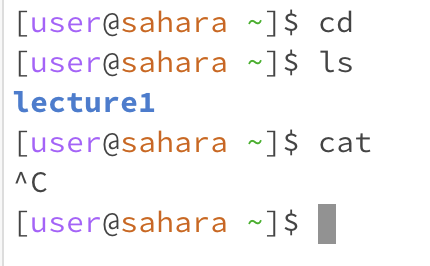
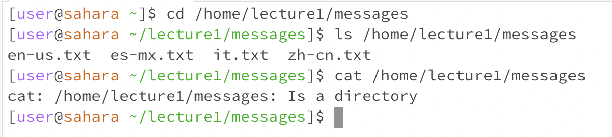
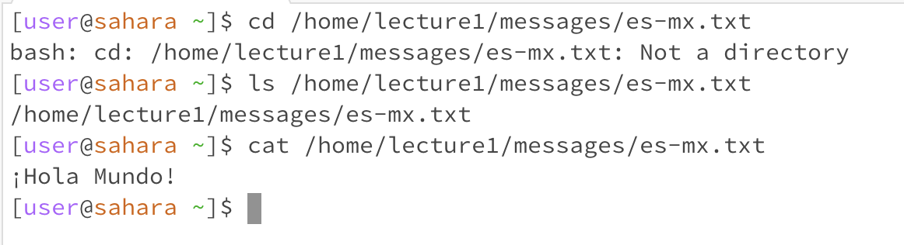

# Lab Report 1 - Remote Access and FileSystem (Week 1)
In each of the following examples we will be going over the commands **cd** "change directory", **ls** "list files", and **cat** "concatenate".
## Examples using the commands with no arguments
  
*All of these examples were done in the home directory*
### cd 
This commands whole purpose is to change the directory you are in. If no argument is given, it does not know which directory you are wanting to change to so as a result nothing is done or shown.
### ls
This command lists or 'prints' the files and/or folder in the given path. Since no path is given, it printed the files and folder within the current directory we were in. In this case we were in the home directory so it only printed 'lecture1' since that is the only folder in that directory.
### cat
This commands purpose is to print the contents of one or more files given by the provided path. There is an error because no path or argument was given, and it simply does not let you run it. Ultimately it is awaiting for the user to input a path, but in this case you have to use '^C' to exit.
## Examples using the commands with a path to a directory as an argument
  
*The first example was done in the home directory, and the last two were done in the messages directory*
### cd
Now that the command has been given a path to follow, it can change the directory. The path given was '/home/lecture1/messages' so it should and did change to the messages directory. 
### ls
Now that the command has been given a path to follow, it can list all the files and/or folders. Since the path that I provided led to the  working directory messages, there was no need for an argument. For example purposes the path certainly helped to visualize how to properly use the command. As seen the the screenshot, with the given path, all the folders/files in the messages directory were printed.
### cat
As I mentioned earlier, the cat command prints the contents of one or more files. Since the path provided led to a directory/folder the command was unable to properly function. Instead of printing a files content, it informed the user that the argument was indeed a directory.
## Examples using the commands with a path to a file as an argument
  
*All of these examples were done in the home directory*
### cd
As we know, the cd command is used to change directories. In this example the given path led to a file which evidently meant that command was unable to properly frunction. Instead a message was printed informing the user that the path given was not to a directory. 
### ls
As we saw in the last set of examples, a path can be used as an argument when using the ls command. A very important difference is that this path led to a file, so the command was unable to properly function. No content was printed because a file connot hold any files and/or folders. In respose to this path, the command simply printed the path again.
### cat
In this example we get to finally see a functioning cat command. Since the path given was to a file, its content was printed. In this case the path leads to a file named 'es-mx.txt' and prints its content which is '¡Hola Mundo!' which means 'Hello World!' in Mexican Spanish.
