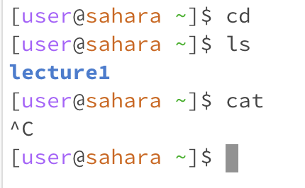

# Lab Report 1 - Remote Access and FileSystem (Week 1)
In each of the following examples we will be going over commands **cd** "change directory", **ls** "list files", and **cat** "concatenate".
## Examples using the commands with no arguments
  
### cd 
Since you do not have an argument you are not providing a driectory you would like to change to so nothing is done.
### ls
Using the ls command
### cat

  Since we do not have an argument using the cat only open an empty

     -ls
     -cat opened an empty writing node
## Examples using the commands with a path to a directory as an argument
     -cd
     -ls
     -cat
## Examples using the commands with a path to a file as an argument
     -cd
     -ls
     -cat
