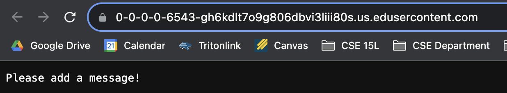
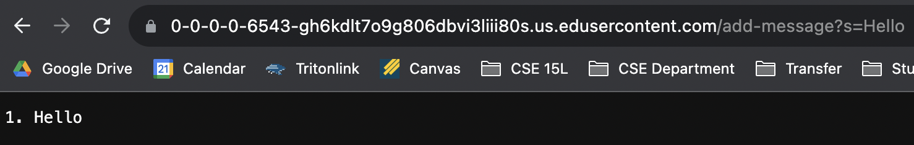
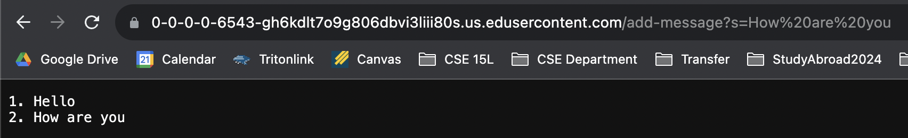
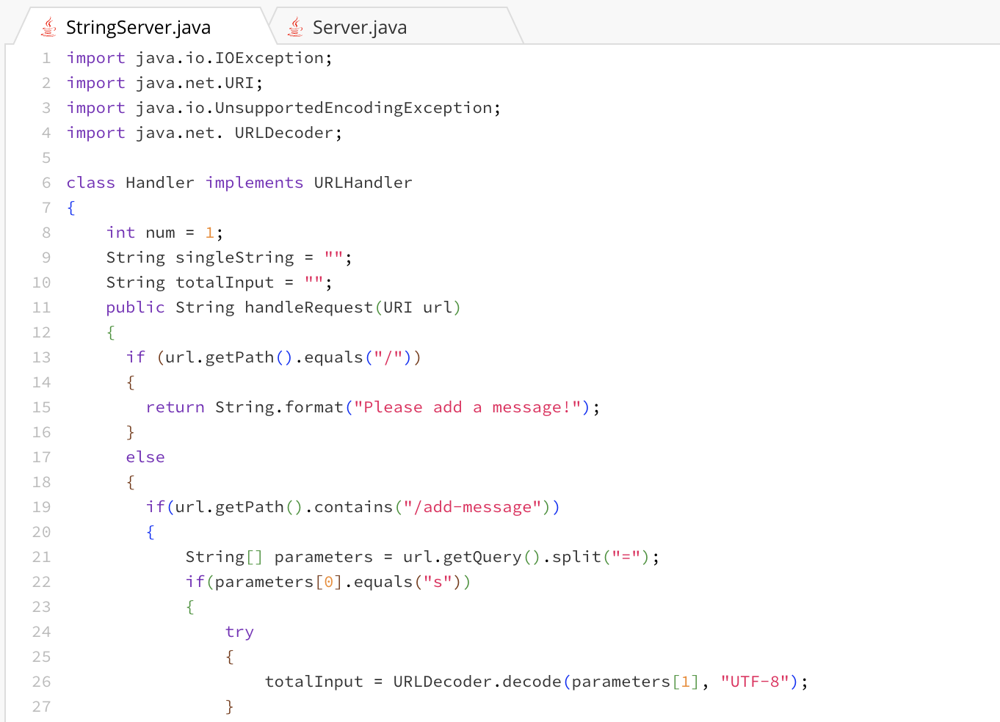
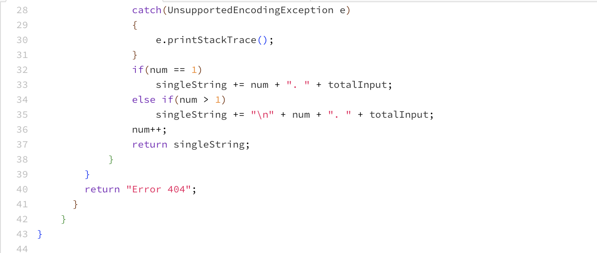
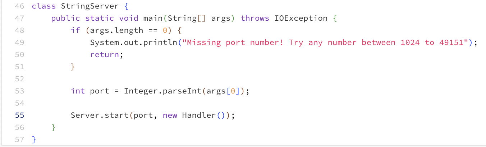
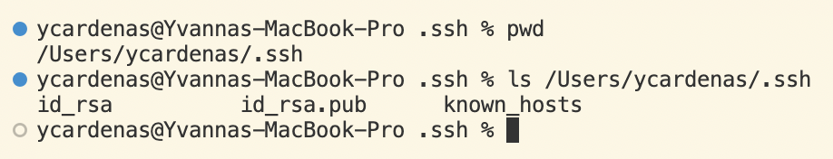
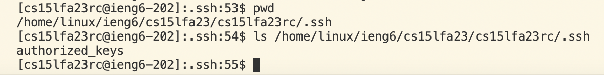
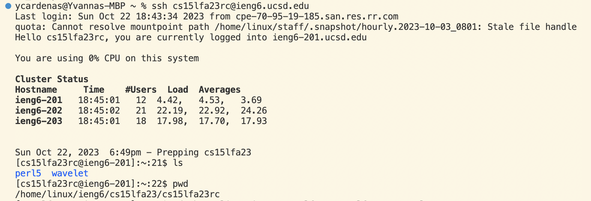

# Lab Report 2 - Servers and SSH Keys
## Part 1
I have created a web server called StringServer that supports the path and behavior described below. It keeps track of a single string that gets added to by incoming requests that look like "/add-message?s=<String>".
 Before any request has been added, the server shows this page which is encouraging the user to input their message!

### Example 1
After adding the request "/add-message?s=Hello" we get this page:
 
- After adding this request, the following methods were called with their relevent arguments:
 - handleRequest(URI url)
 - url.getPath().contains("/add-message")
 - url.getQuery().split("=")
 - parameters[0].equals("s)
 - URLDeoder.decode(parameters[1], "UTF-8")
- These are the values of any relevent fields of the class
 - int num = 1;
 - String totalInput = "";
 - String singleString = "";
 - String[] parameters = {};
 - URI url = 0-0-0-0-6543-gh6kdlt7o9g806dbvi3liii80s.us.edusercontent.com/;
- This is how this specific request changed the values of the relevent fields of the class
 - int num = 2;
 - String totalInput = "Hello";
 - String singleString = "1. Hello";
 - String[] parameters = {"s","Hello"};
 - URI url = 0-0-0-0-6543-gh6kdlt7o9g806dbvi3liii80s.us.edusercontent.com/add-message?s=Hello;
### Example 2
After adding the request "/add-message?s=How are you" we get this page:

- After adding this request, the following methods were called with their relevent arguments: 
 - handleRequest(URI url)
 - url.getPath().contains("/add-message")
 - url.getQuery().split("=")
 - parameters[0].equals("s)
 - URLDeoder.decode(parameters[1], "UTF-8")
- These are the values of any relevent fields of the class
 - int num = 2;
 - String totalInput = "Hello";
 - String singleString = "1. Hello";
 - String[] parameters = {"s","Hello"};
 - URI url = 0-0-0-0-6543-gh6kdlt7o9g806dbvi3liii80s.us.edusercontent.com/add-message?s=Hello;
- This is how this specific request changed the values of the relevent fields of the class
 - int num = 3;
 - String totalInput = "How are you";
 - String singleString =  "1. Hello  2. How are you";
 - String[] parameters = {"s","How%20are%20you"};
 - URI url = 0-0-0-0-6543-gh6kdlt7o9g806dbvi3liii80s.us.edusercontent.com/add-message?s=How%20are%20you;
 
### StringServer.java
Here is a screenshot of the StringServer code

## Part 2
Here is a screenshot of the path to the private key for my SSH key for logging into ieng6 on my computer:

Here is a screenshot of the path to the public key for my SSH key for logging into ieng6 with my ieng6 account:

Here is a screen shot of a terminal interaction where I log into ieng6 with my course specific account without being asked for a password:

## Part 3
To be honest, everything we learned was completely new to me. I specifically really enjoyed using the man command to learn about the mkdir and scp commands. I had heard about them during Week 1 but I had not idea how to use them or how exactly they worked. I learned that the scp stands for secure copy, and it supports the use of passwords or ssh key authentication. I also learned that the mkdir command stands for make directory and it actually appeared in the Version 1 AT&T UNIX.

