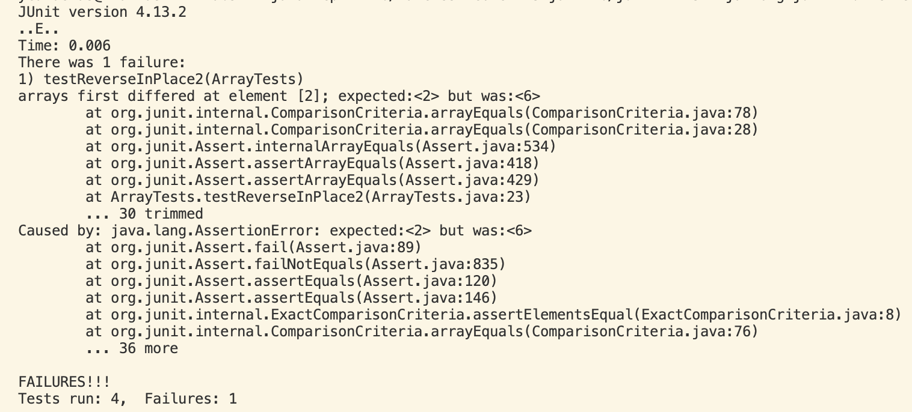

# Lab Report 3 - Bugs and Commands
## Part 1 - Bugs
Choose one of the bugs from week 4's lab
### Chosen Bug: The reversedInPlace method found in ArrayExamples that fail to correctly change the input array to be in reversed order.
- A failure-inducing input for the buggy program, as a JUnit test and any associated code (write it as a code block in Markdown)
<br>JUnit test that has a failure-inducting input:
``` java
  @Test
  public void testReverseInPlace2(){
    int[] input1 = { 2, 4, 6};
    ArrayExamples.reverseInPlace(input1);
    assertArrayEquals(new int[]{ 6, 4, 2}, input1);
  }
```
- An input that doesn’t induce a failure, as a JUnit test and any associated code (write it as a code block in Markdown)
<br>JUnit test that does not induce a failure: 
``` java
	@Test 
	public void testReverseInPlace1() {
    int[] input1 = { 3 };
    ArrayExamples.reverseInPlace(input1);
    assertArrayEquals(new int[]{ 3 }, input1);
	}
```
### The symptom:

- The bug, as the before-and-after code change required to fix it (as two code blocks in Markdown)
Briefly describe why the fix addresses the issue:
``` java
  static void reverseInPlace(int[] arr) {
    for(int i = 0; i < arr.length; i += 1) {
      arr[i] = arr[arr.length - i - 1];
    }
  }
```
``` java
  static void reverseInPlace(int[] arr) {
    for(int i = 0; i < (arr.length/2); i += 1) {
      int tempInt = arr[i];
      arr[i] = arr[arr.length - i - 1];
      arr[arr.length -i - 1] = tempInt;
    }
  }
```
This fix has multiple parts that ultimately all together address the issue. Firstly, since we are simply swapping the elements in the input array, there is no need to recurse through the entire array, as this will just result with the exact same input array. Alternatively, we only recurse through half of the input array, swapping every element just once. Secondly, it is important that initialize a temporary integer that can keep track of the number we are kicking, or swapping out. This ensures that the value is not 'lost'. Lastly it is important that we complete the swap by setting our tempInt into its new position which is where we got our previous number.
## Part 2 - Researching Commands
- Consider the commands less, find, and grep. Choose one of them. Online, find 4 interesting command-line options or alternate ways to use the command you chose. To find information about the commands, a simple Web search like “find command-line options” will probably give decent results. There is also a built-in command on many systems called man (short for “manual”) that displays information about commands; you can use man grep, for example, to see a long listing of information about how grep works. Also consider asking ChatGPT!
- For example, we saw the -name option for find in class. For each of those options, give 2 examples of using it on files and directories from ./technical. Show each example as a code block that shows the command and its output, and write a sentence or two about what it’s doing and why it’s useful.
### Chosen Command: find
The find command is used to search for files and directories within a specified directory hierarchy
__Command-Line Option 1: "-type"__
<br>1. The first example for the 'type' option is using 'f' which searches for regular files. This is useful because 
<br>Command:
```
```
<br>Output:
```
```
<br>2. The second example for the 'type' option is using 'd' which searches for directories. This is useful because 
<br>Command:
```
```
<br>Output:
```
```
<br> __Command-Line Option 2:"-print"__
<br>1. The first example for the 'print' option is using '' which . This is useful because 
<br>Command:
```
```
<br>Output:
```
```
<br>2. The second example for the '' option is using '' which. This is useful because 
<br>Command:
```
```
<br>Output:
```
```
<br> __Command-Line Option 3:"-name"__
<br>1. The first example for the 'name' option is using '' which. This is useful because 
<br>Command:
```
```
<br>Output:
```
```
<br>2. The second example for the 'name' option is using '' which . This is useful because 
<br>Command:
```
```
<br>Output:
```
```
<br> __Command-Line Option 4:"-mtime n"__
<br>1. The first example for the 'mtime' option has n = 7 where the command searches for files modified approximately "n" days ago which in this case is 7 days. This is useful because 
<br>Command:
```
```
<br>Output:
```
```
<br>2. The second example for the 'mtime' option has n = 2 where the command searches for files modified approximately "n" days ago which in this case is 2 days. This is useful because 
<br>Command:
```
```
<br>Output:
```
```
- Along with each option/mode you show, cite your source for how you found out about it as a URL or a description of where you found it. See the syllabus on Academic Integrity and how to cite sources like ChatGPT for this class.
