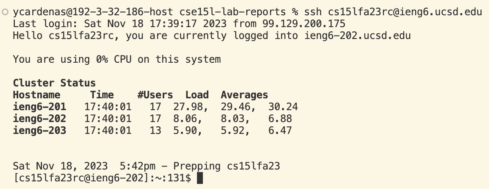
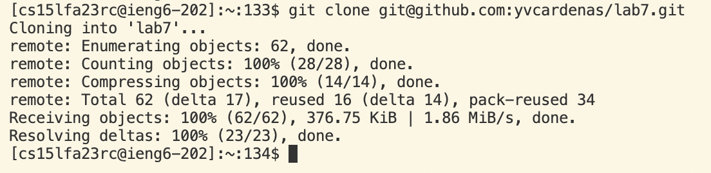
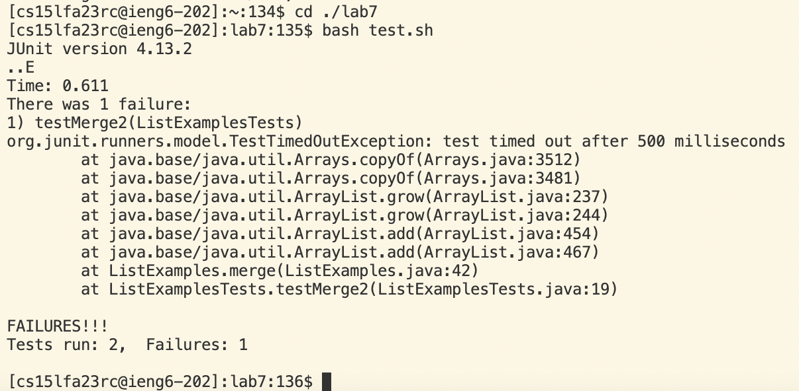
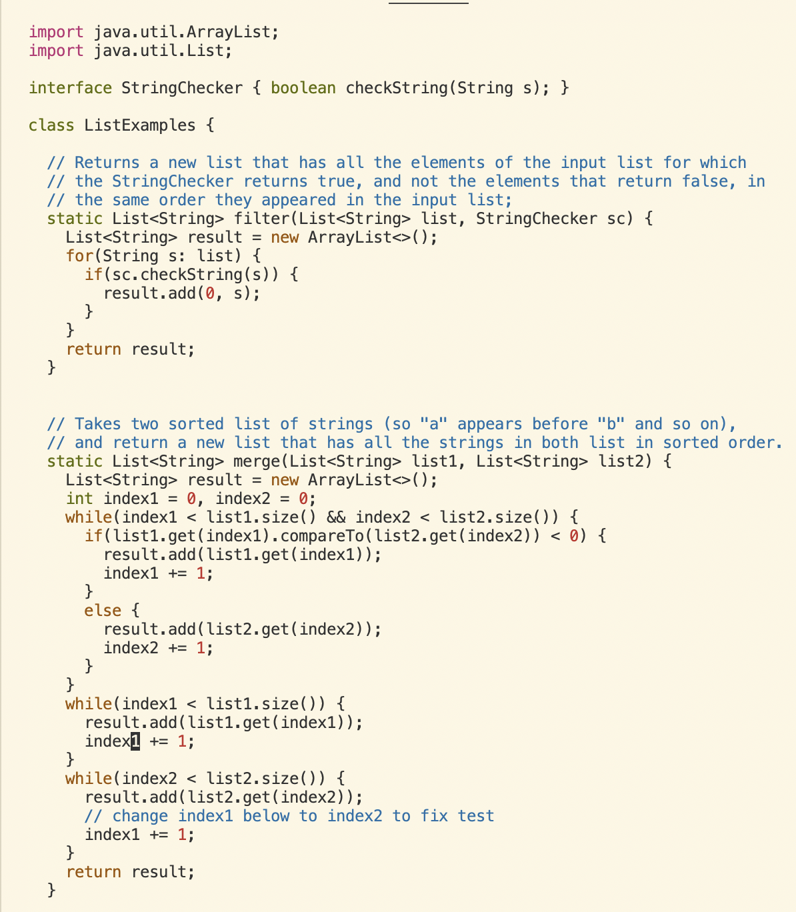
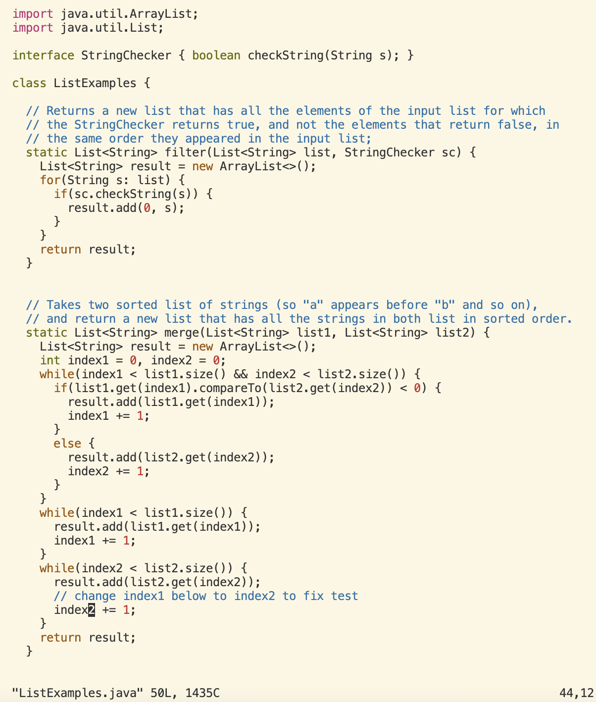
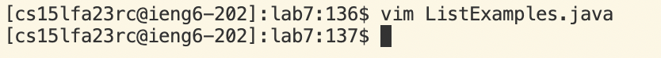
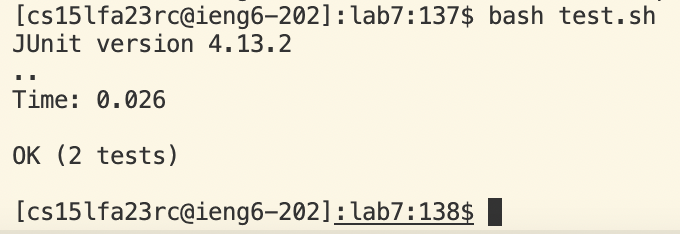
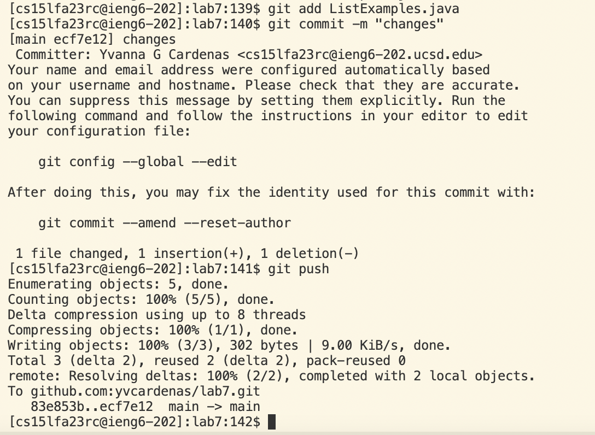

# Lab Report 4 - Vim
In this lab report, I will be reproducing steps 4 - 9 from the Week 7 lab, summarizing the steps and keys I used during their process. 
## Step 4 - Log into ieng6
### **Screenshot for step 4:**

### **Keys pressed**

- `<up>` `<up>` `<enter>`
### **Summary/Effect of Keys**
The `ssh cs15lfa23rc@ieng6.ucsd.edu` command was 2 `<up>` the search history, so I used the up arrow to access it.
## Step 5 - Clone your fork of the repository from you GitHub account
### **Screenshot for step 5:**

### **Keys pressed**
- `<g>` `<i>` `<t>` `<space>` `<c>` `<l>` `<o>` `<n>` `<e>` `<space>` `<command>` `<v>`
### **Summary/Effect of Keys**
This command was really far up my search history so I decided to write it out. After typing `git clone` I used the paste command `<command>` `<v>` on my mac to paste the ssh git link I had copied previosly.
## Step 6 - Run the tests, demonstratin that they fail
### **Screenshot for step 6:**

### **Keys pressed**
- `<c>` `<d>` `<space>` `<.>` `</>` `<l>` `<a>` `<b>` `<7>` `<enter>`
- `<b>` `<a>` `<s>` `<h>` `<space>` `<t>` `<e>` `<s>` `<t>` `<.>` `<s>` `<h>` `<enter>`
### **Summary/Effect of Keys:**
Again here the command was far up my search history so I decided it was more time efficient to write it out. The first bullet are the keys I used to change the directory to lab7. The second bullet are the keys I used to run the tests.
## Step 7 - Edit the code file to fix the failing test
### **Screenshot for step 7:**
**The original code of ListExamples.java:**

  
**The fixed code of ListExamples.java**

   **The use of vim that allowed me to edit the ListExamples.java file:**

### **Keys pressed:**
- `<up>` `<up>` `<up>` `<up>` `<up>` `<up>` `<up>` `<up>` `<up>` `<up>` `<up>` `<up>` `<up>` `<enter>`
- `<?>` `<1>` `<enter>` `<n>` `<r>` `<2>` 
- `<:>` `<w>` `<q>` `<enter>`
### **Summary/Effect of Keys:**
The first bullet are the keys I used to run vim on the ListExamples.java file. The command was in my search history so I used the up key to find it, and the enter key to run it. The second bullet are the keys I used to edit the file so the tests can properly run. The "`<?>` `<1>` `<enter>`" finds the last 1 on the file, and the `<n>` moved me up to the precious "1" which is the one we were intending to change. By pressing `<r>` `<2>` I was able to replace the 1 with the correct number 2. The third bullet are the keys I used to save the file and quit vim. The `<w>` saved my changes and the `<q>` allowed me to quit. 
## Step 8 - Run the tests, demonstrating that they now succeed
### **Screenshot for step 8:**

### **Keys pressed:**
- `<up>` `<up>` `<up>` `<enter>`
### **Summary/Effect of Keys:**
The `bash test.sh` command was 3 up in my search history since we used it in step 6, so I used the `<up>` key to find it and the `<enter>` key to run it. 
## Step 9 - Commit and push the resulting change to you github account
### **Screenshot for step 9:**

### **Keys pressed:**
- `<up>` `<up>` `<up>` `<up>` `<up>` `<up>` `<up>` `<up>` `<up>` `<up>` `<up>` `<up>` `<up>` `<enter>`
- `<up>` `<up>` `<up>` `<up>` `<up>` `<up>` `<up>` `<up>` `<up>` `<up>` `<up>` `<up>` `<enter>`
- `<up>` `<up>` `<up>` `<up>` `<up>` `<up>` `<up>` `<up>` `<up>` `<up>` `<up>` `<enter>`
### **Summary/Effect of Keys:**
The `git add ListExamples.java` command was 13 keys up in my search history so I used the `<up>` key to find it and the `<enter>` key to run it. Similarily I used these keys to run the `git commit -m "changes` which was 12 `<up>` and the `git push` command which was 11 `<up>`.