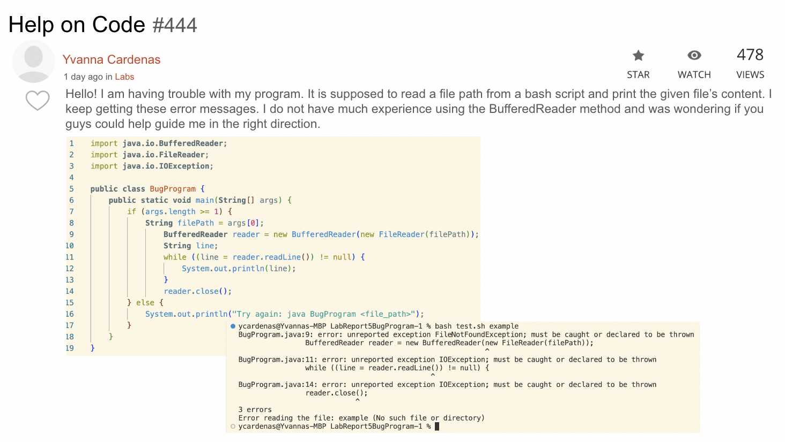
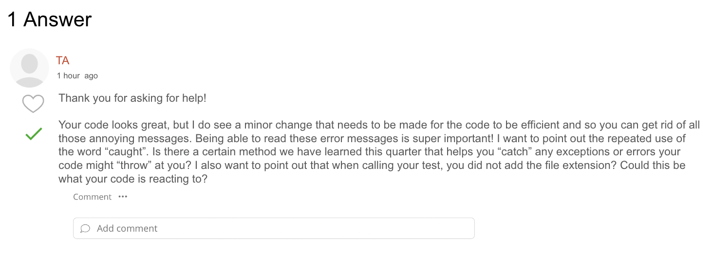
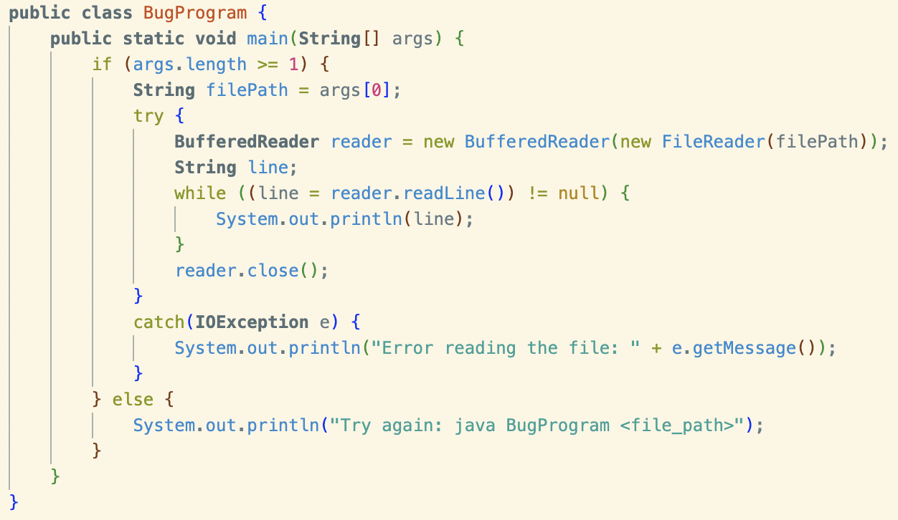
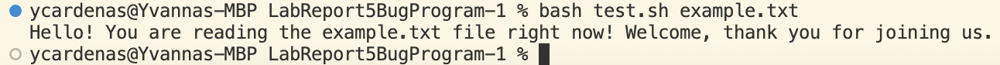
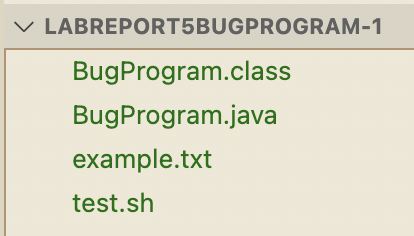

# Lab Report 5 - Putting it All Together (Week 9)
## Part 1 - Debugging Scenario
In this lab report I will be designing a debugging scenario as a conversation on EdStem.
## Here is the original post from a student

This is not an actual post, I made this image on PowerPoint.
## A response from a TA

This is not an actual response from a tutor, I made this image on PowerPoint.
## Here is a screenshot/terminal output showing what information the student got from trying that

### Clear description of what the bug is:
I think when you are writing code it is important to consider user error, and make sure your code "bullet proof" so no matter what the user does, the program is prepared for it. In this case the user did not add the file's extension and since the Java program does not check the file extension, it tried to read any file, which resulted in many exceptions. Thus its important to add a try/catch method to catch any errors.
## All the information needed about the setup including:
### The file and directory structure needed:

### The contents of each file before fixing the bug:
**BugProgram.java** 
`import java.io.BufferedReader;`  
`import java.io.FileReader;` 
`import java.io.IOException;`

`public class BugProgram {`  
&nbsp;&nbsp;&nbsp;&nbsp;`public static void main(String[] args) { ` 
&nbsp;&nbsp;&nbsp;&nbsp;&nbsp;&nbsp;&nbsp;&nbsp;`if (args.length >= 1) {` 
&nbsp;&nbsp;&nbsp;&nbsp;&nbsp;&nbsp;&nbsp;&nbsp;&nbsp;&nbsp;&nbsp;&nbsp;`String filePath = args[0];` 
&nbsp;&nbsp;&nbsp;&nbsp;&nbsp;&nbsp;&nbsp;&nbsp;&nbsp;&nbsp;&nbsp;&nbsp;`BufferedReader reader = new BufferedReader(new FileReader(filePath));` 
&nbsp;&nbsp;&nbsp;&nbsp;&nbsp;&nbsp;&nbsp;&nbsp;&nbsp;&nbsp;&nbsp;&nbsp;`String line;` 
&nbsp;&nbsp;&nbsp;&nbsp;&nbsp;&nbsp;&nbsp;&nbsp;&nbsp;&nbsp;&nbsp;&nbsp;`while ((line = reader.readLine()) != null) {` 
&nbsp;&nbsp;&nbsp;&nbsp;&nbsp;&nbsp;&nbsp;&nbsp;&nbsp;&nbsp;&nbsp;&nbsp;&nbsp;&nbsp;&nbsp;&nbsp;&nbsp;&nbsp;&nbsp;&nbsp;` System.out.println(line);` 
&nbsp;&nbsp;&nbsp;&nbsp;&nbsp;&nbsp;&nbsp;&nbsp;&nbsp;&nbsp;&nbsp;&nbsp;`}` 
&nbsp;&nbsp;&nbsp;&nbsp;&nbsp;&nbsp;&nbsp;&nbsp;&nbsp;&nbsp;&nbsp;&nbsp;`reader.close();` 
&nbsp;&nbsp;&nbsp;&nbsp;&nbsp;&nbsp;&nbsp;
&nbsp;&nbsp;&nbsp;&nbsp;`}` 
&nbsp;&nbsp;&nbsp;&nbsp;&nbsp;&nbsp;&nbsp;&nbsp;`} else {` 
&nbsp;&nbsp;&nbsp;&nbsp;&nbsp;&nbsp;&nbsp;&nbsp;&nbsp;&nbsp;&nbsp;&nbsp;` System.out.println("Try again: java BugProgram <file_path>");` 
&nbsp;&nbsp;&nbsp;&nbsp;&nbsp;&nbsp;&nbsp;&nbsp;`}` 
&nbsp;&nbsp;&nbsp;&nbsp;`}` 
`}`  
**test.sh** 
`javac BugProgram.java`  
`java BugProgram "$1"`  
**example.txt**  
`Hello! You are reading the example.txt file right now! Welcome, thank you for joining us.`
### The full command line (or lines) ran to trigger the bug:
I created a bash script called test.sh compile the program and pass to first command file argument(the file path) to the program. To run the bash script I ran `<bash test.sh example>` in the terminal. 
### A description of what to edit to fix the bug:
As previously mentioned, in order to create a more "bullet proof" program, it is important to always implement a try/catch method to catch any unexpected errors. In this case the try block needs to have all the code seen in the if statement which is essentially all our error causing code. This is of course followed by a catch block that will catch any exception thrown and display a message that will explain to the user what happened. 

# Part 2 - Reflection
I learned a lot from my classmates this quarter! Surprising the most useful thing I learned that I now use hundreds of times every day is taking a screenshot and then being able to immediately paste it onto a document. You can take the screenshot by pressing `<comman>` `<control>` `<shift>` `<4>` all at the same time and then paste with `<command>` `<v>`. Especially during lab, I would repeatedly need to add screenshots to documents so this was a faster and more efficient way of doing it than I had been before. Over all though, I learned a lot of small things like this from my peers since we spent so much time collaborating and sharing knowledge. 